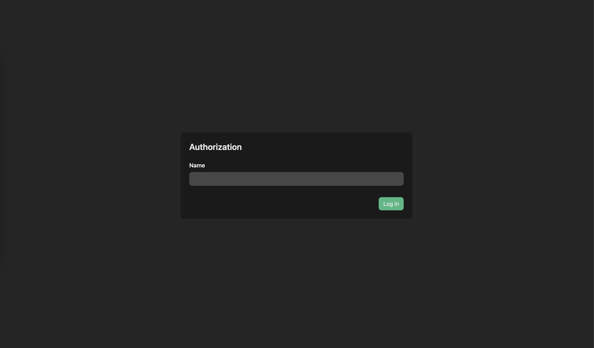
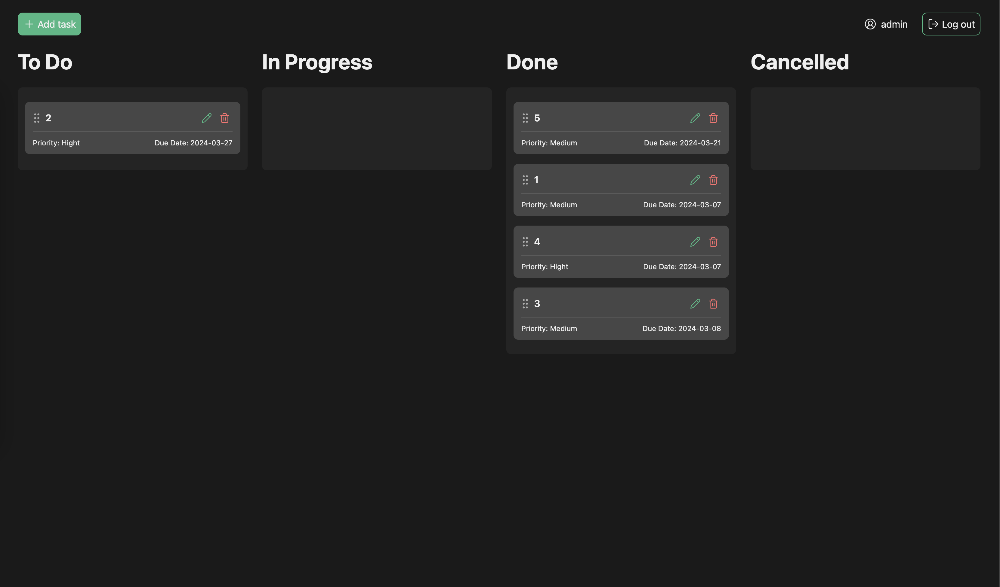
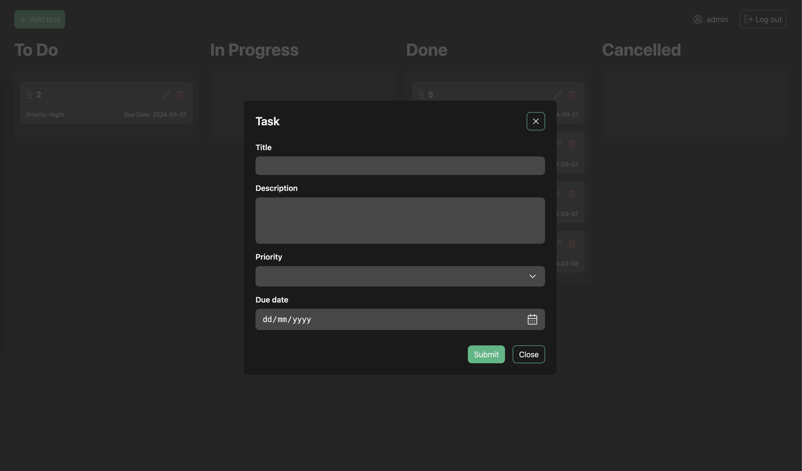

# QA Board ⚙️

- [Frontend app](https://github.com/kostyamm/qa-board/tree/main/client) Vue 3 / Vite / Pinia 
- [Backend app](https://github.com/kostyamm/qa-board/tree/main/server) Express / MongoDB (mongoose)

## About 📝
Application for QA trainees to check testing skills, with specially added errors

## Launch developer mode 🏗
#### For server and client directory

- ``npm ci && npm run dev``

## Screenshots 🤳
### Login

### Task board

### Create a task

